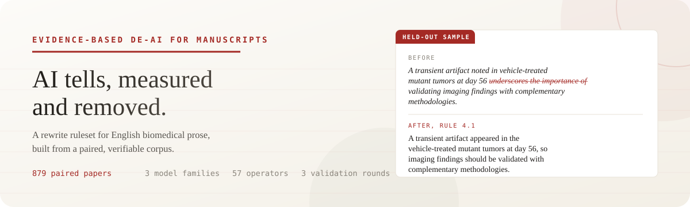

# less-ai-tone-academic

[](LICENSE)
[](results/VALIDATION.md)
[](data/manifest.csv)



English | [中文](README.zh-CN.md)

A rewrite ruleset that removes AI writing tells from English biomedical manuscripts. Unlike checklist-style humanizers, every rule here survived a measurement: a paired corpus, preregistered thresholds, and three rounds of held-out validation.

- [`SKILL.md`](SKILL.md) carries the rules (v2.2). Install it as an agent skill or paste it as a system prompt.
- [`results/VALIDATION.md`](results/VALIDATION.md) documents three validation rounds on 148 held-out documents, including every defect found and what fixed it.
- [`PROTOCOL.md`](PROTOCOL.md) froze the thresholds before the AI side was measured.
- [`data/manifest.csv`](data/manifest.csv) lists all 879 human papers with PMCID, DOI and license, so every number in this repo can be checked independently.

## How the corpus was built

The human side is 879 CC-BY papers from 16 journals, published 2018 to mid-2022, before LLM assistance was common. The AI side was generated from the same articles: each model received only the title, keywords and Results section, with no style instructions, and wrote its own abstract, introduction and discussion. Same facts, two origins. Topic confounds drop out of the comparison.

Three model families contributed: MiniMax M2.7 and M3, and a GLM-5.3 agent channel. The 583 generated sections are included in this repo under `data/ai/`.

A feature became a rule only if its AI-to-human frequency ratio had a bootstrap 95% CI with lower bound at or above 2.0. Twelve control features were preregistered as never-rules to catch misclassifications; four of them flipped (AI uses them more), and the validation report says so rather than quietly promoting them.

## What the corpus shows

| Tell | AI vs human | Rule |
|---|---|---|
| Reveal-style em-dashes | 5.1 to 8.6x | 1.1 |
| Trailing result clauses (", suggesting...") | 2.4 to 6.3x | 1.2 |
| "underscore" in conclusions | 17x | 4.1 |
| "foster / pave the way / leverage" family | 5.8 to 29x | 4.2 |
| not-X-but-Y self-heralding | 21.9x in discussions | 4.4 |
| First person "we" in abstracts | 0.43x (AI avoids it) | 2.1 restores it, capped at human density |

The anti-rules matter as much. Delve, showcase, meticulous and the rest of the famous word lists occur at roughly zero in 2026 models, and human authors use "crucial" and "play a crucial role" several times more than AI does. Rewriting by internet word lists makes a manuscript more detectable, not less. So the ruleset protects hedges, passive voice in methods, semicolons, and the ordinary vocabulary of academic prose.

Section awareness is load-bearing: what marks an AI abstract (avoiding "we") is the opposite of what marks an AI introduction. The rules are organized by section for that reason.

## Validation

Three independent rounds on fresh, non-overlapping samples (66, 54 and 28 documents; the paired pool is now spent):

| Metric | Round 1 | Round 2 | Round 3 |
|---|---|---|---|
| Signal clearance, main tells | 83 to 100% | 67 to 100% | 81 to 100% |
| Residuals adjudicated as correct non-edits | all | all | all |
| Number sequences unchanged | 59/59 | 52/54 | 26/26 |
| Hedges upgraded | 0 | 0 | 0 |
| Anti-rule violations | 0 | 0 | 0 |

Each round found rule defects (11, then 10, then 6, with example sentences in the report). Each revision was re-validated on new documents in the next round. Nine editing accidents across rounds were all caught by mandatory diff checks, which is why the diff check is a rule.

## Use

```bash
npx skills add elK-liang/less-ai-tone-academic
```

Or copy `SKILL.md` into any tool that accepts custom instructions. Feed it a finished draft. It touches only whitelisted patterns, keeps every number, citation, hedge and figure callout byte-for-byte, and leaves unmatched sentences alone.

This tool is for authors cleaning their own drafts, consistent with journal AI-disclosure policies. It is not for evading academic-integrity screening.

## Reproduce

```bash
python scripts/fetch_corpus.py        # human side, from Europe PMC via the manifest
python scripts/generate_ai_side.py   # AI side, facts-only prompts
python scripts/measure_en.py --human data/human/introductions --ai "data/ai/*/introduction"
```

## Lineage and limits

The method follows [lieflat-less-ai-tone](https://github.com/larashero3-dotcom/lieflat-less-ai-tone), which did this for Chinese on a 2.83M-character corpus. This repo upgrades three things it acknowledged as weaknesses: topics are paired article by article, the human corpus is public and verifiable rather than withheld, and inclusion thresholds carry confidence intervals.

Limits, stated plainly: the model panel is free-tier (no GPT, Claude or Gemini fingerprints yet); one generation channel is an agent harness rather than a bare API, and is documented as such; findings are dated, since models keep converging toward human style; and a 2018-2022 human corpus cannot fully exclude early-adopter LLM polishing. Details in PROTOCOL.md.

## License

MIT. The generated corpus ships under MIT; human-side metadata (DOIs) lets anyone refetch the original CC-BY texts.
