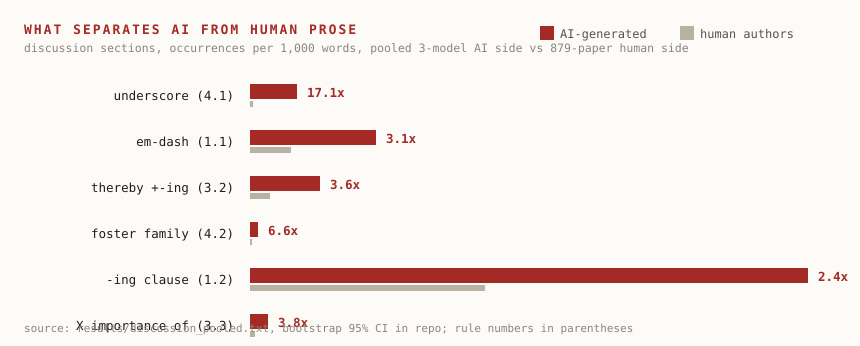

# deai-mark

[](LICENSE)
[](results/VALIDATION.md)
[](data/manifest.csv)


[中文](README.zh-CN.md) | English · [English version](README.md)

> 网上流传的 AI 词表在 2025 年就死了。这个仓库回答的是：AI 起草的英文学术论文和人写的到底差在哪——逐项测量过的差，带置信区间的差，以及哪些"AI 味"根本不该改。

一套给"用 AI 起草英文稿、再自己手工修"的研究者用的改写规则集，对英语非母语的作者尤其有用。每条规则都经过配对语料测量，每个关于"AI 文风"的论断都带频率比和置信区间，不靠语感。

- [`SKILL.md`](SKILL.md)：规则集（v2.2），分节白名单 + 反规则 + 学术豁免
- [`results/VALIDATION.md`](results/VALIDATION.md)：三轮 held-out 验证（148 篇），每个缺陷和修复都有记录
- [`PROTOCOL.md`](PROTOCOL.md)：预注册协议，阈值在测量 AI 侧之前冻结
- [`data/manifest.csv`](data/manifest.csv)：879 篇人类论文的 PMCID/DOI/授权，本仓库每个数字都可独立复核

## 它对一段文字做什么

验证语料里的真实讨论段（AI 生成，held-out）。两条规则命中，其余一字不动。

**改前**

> The reproducibility of the wrinkle formation process across more than twenty experiments **underscores** the robustness of this phenomenon, although the number of wrinkles exhibited some biological variability**, likely reflecting minor differences** in initial bacterial distribution, local growth rates, or subtle variations in substrate properties.

**改后**

> The reproducibility of the wrinkle formation process across more than twenty experiments **indicates** the robustness of this phenomenon, although the number of wrinkles exhibited some biological variability. **This likely reflects minor differences** in initial bacterial distribution, local growth rates, or subtle variations in substrate properties.

规则 4.1 换掉模板动词 underscores；规则 1.2 把句尾 -ing 结果从句拆成有真主语的句子。hedge（may / could / likely）原样保留，数字原样保留，没命中规则的句子一个字不动。这种克制就是产品本身。

## 语料怎么建的

人类侧：16 种期刊的 879 篇 CC-BY 论文，2018 至 2022 年中，LLM 辅助写作普及之前。AI 侧：同一批文章喂给模型——只给标题、关键词和 Results 节，不给任何风格指令，让它自己写摘要、引言、讨论。同样的事实、两种来源，话题混淆从设计里消掉。

三个模型家族：MiniMax M2.7、M3，加一个 GLM-5.3 agent 通道。583 篇生成文本全部随仓库发布在 `data/ai/`。

一个特征要成为规则，AI/人频率比的 bootstrap 95% 置信区间下界必须 ≥ 2.0。12 个对照特征预注册为"永不入选"以捕捉误分类；其中 4 个实测翻转（AI 用得更多），验证报告如实记录，没有悄悄转正。

## 测到了什么



| 痕迹 | AI vs 人类 | 规则 |
|---|---|---|
| 揭晓式破折号 | 5.1–8.6 倍 | 1.1 |
| 句尾 -ing 结果从句（, suggesting...） | 2.4–6.3 倍 | 1.2 |
| 讨论节 underscore | 17 倍 | 4.1 |
| foster / pave the way / leverage 家族 | 5.8–29 倍 | 4.2 |
| not X but Y 自我翻案 | 讨论节 21.9 倍 | 4.4 |
| 摘要第一人称 we | 0.43 倍（AI 回避） | 2.1 恢复，封顶人类密度 |

反规则同样重要。delve、showcase、meticulous 这批网红词在 2026 年的模型里接近零，而人类作者用 crucial、play a crucial role 比 AI 多好几倍。按网传词表改稿会让文章更容易被认出来，不是更难。所以规则集保护 hedge、方法节的被动语态、分号，和学术英语的正常词汇。

分节是承重结构：标记 AI 摘要的特征（回避 we）和标记 AI 引言的特征正好相反。规则按节组织就是这个原因。

## 验证

三轮独立验证，样本互不重叠（66、54、28 篇；配对池已用尽）：

| 指标 | 第一轮 | 第二轮 | 第三轮 |
|---|---|---|---|
| 主信号清除率 | 83–100% | 67–100% | 81–100% |
| 残留全部定性为"正确的不改" | 是 | 是 | 是 |
| 数字序列零变化 | 59/59 | 52/54 | 26/26 |
| hedge 被升级 | 0 | 0 | 0 |
| 反规则违规 | 0 | 0 | 0 |

每轮都翻出规则缺陷（11、10、6 条，例句在报告里）。每次修订都在下一轮的新样本上重新验证。三轮里 9 次编辑事故全部被强制的 diff 检查当场拦截——所以 diff 检查本身就是一条规则。

## 安装

把这句话发给你的 Agent：

```text
帮我安装这个skill：https://github.com/elK-liang/deai-mark
```

或直接安装：

```bash
npx skills add elK-liang/deai-mark
```

也可以把 [`SKILL.md`](SKILL.md) 复制进任何支持自定义指令的工具。喂给它一份成稿。它只动白名单内的模式，数字、引用、hedge、图表指代逐字节保留，没命中规则的句子原样放着。

本工具用于作者清理自有稿件，符合期刊 AI 使用披露政策；不用于规避学术诚信筛查。

## 复现

```bash
python scripts/fetch_corpus.py        # 人类侧，经 manifest 从 Europe PMC 拉取
python scripts/generate_ai_side.py   # AI 侧，仅事实提示词
python scripts/measure_en.py --human data/human/introductions --ai "data/ai/*/introduction"
```

## 仓库结构

```text
SKILL.md              规则集（v2.2）
PROTOCOL.md           预注册协议
features/CANDIDATES.md  57 个候选算子，12 个对照组
scripts/              抓取 / 生成 / 测量 / 清洗脚本
data/ai/              583 篇生成文本（随仓库发布）
data/manifest.csv     879 篇人类论文清单
results/              验证报告 + 全部测量表 + README 标杆调研
validation*/          三轮验证的 before/after 原文
```

## 谱系与局限

方法学参照 [lieflat-less-ai-tone](https://github.com/larashero3-dotcom/lieflat-less-ai-tone)（中文，283 万字语料）。本仓库升级了它自认的三处弱点：话题逐篇配对、人类语料公开可核验（而非保留不公开）、入选阈值带置信区间。

局限，明说：模型面板是免费档（还没有 GPT / Claude / Gemini 指纹）；一条生成通道是 agent harness 而非裸 API，已如实记录；结论带日期——模型在持续向人类文风收敛；2018–2022 的人类语料无法完全排除早期使用者的 LLM 润色。细节见 PROTOCOL.md。

## 致谢与出处

本项目站在下列工作之上，按影响顺序列出：

- **[larashero3-dotcom/lieflat-less-ai-tone](https://github.com/larashero3-dotcom/lieflat-less-ai-tone)**（MIT）：方法学基础——配对语料测量框架、算子设计与抽样质检纪律、反规则概念、公开失败记录的做法。我们的三点升级（逐篇配对、语料公开、置信区间阈值）正是对它自述局限的针对性回应。
- **超额词汇研究**（`features/CANDIDATES.md` 中 P 类候选词的来源）：Kobak 等（2024）《Delving into ChatGPT usage in academic writing through excess vocabulary》（arXiv:2406.07016）；Liang 等（2024）《Monitoring AI-modified content at scale》（arXiv:2403.07183）；以及学术文本 LLM 词频漂移的相关分析。
- **[blader/humanizer](https://github.com/blader/humanizer)** 与维基百科 ["Signs of AI writing"](https://en.wikipedia.org/wiki/Wikipedia:Signs_of_AI_writing)：英文检查清单传统。其若干模式进入了我们的候选清单——是经过测量后采信或否决，而非直接沿用。
- **页面设计**：README 结构参考了六个高星仓库的模式提炼（blader/humanizer、zenstory-ai/oh-story-claudecode、larashero3-dotcom/lieflat-charts、KKKKhazix/human-writing、larashero3-dotcom/writing-dna-skill、Nanako0129/sepia），完整调研随仓库发布于 [`results/README_BENCHMARK.md`](results/README_BENCHMARK.md)。

## 许可

MIT。生成语料按 MIT 发布；人类侧只随附元数据（DOI），原文本可由任何人从 CC-BY 来源重新获取。
